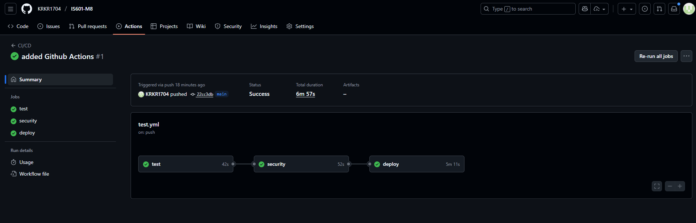

# 🧮 FastAPI Calculator — Module 8 Assignment
**Author:** Roopesh Kumar Reddy Kaipa<br>
**Date:** 10/27/2025<br>
**GitHub Repository:** [KRKR1704/IS601-M8](https://github.com/KRKR1704/IS601-M8)<br>
**Docker Hub Image:** [zabuza1704/is601-m8](https://hub.docker.com/r/zabuza1704/is601-m8)

---

## Task Description

This project implements an **Advanced FastAPI-based Calculator Application** designed as part of the **IS601 - Module 8 Assignment**.  
The application supports arithmetic operations through REST API endpoints and includes **comprehensive testing**, **logging**, and **CI/CD automation**.

### Key Features
- FastAPI-based backend for calculator operations (addition, subtraction, multiplication, division and Power).
- Organized codebase with modular structure (`app/` directory).
- Unit tests for each function in `operations.py`.
- Integration tests for API endpoints in `main.py`.
- End-to-End (E2E) testing using **Playwright**.
- Logging integrated across the application to capture both successful operations and errors.
- **Continuous Integration** via **GitHub Actions** to run automated tests on every push.
- Dockerized setup for consistent deployment and execution.

---

## Run the Project

### Run Locally (Without Docker)

1. **Clone the repository**
   ```bash
   git clone <git link>
   cd <folder_name>
   ```

2. **Create a Virtual Environment**
   ```bash
   python3 -m venv venv
   source venv/bin/activate      # For Mac/Linux
   venv\Scripts\activate.bat     # For Windows
   ```

3. **Install dependencies**
   ```bash
   pip install -r requirements.txt
   ```

4. **Run FastAPI Application**
   ```bash
   uvicorn main:app --reload
   ```

5. **Open in Browser**
   ```
   http://127.0.0.1:8000
   ```
   Interactive API docs available at:  
   👉 [http://127.0.0.1:8000/docs](http://127.0.0.1:8000/docs)

---

### Run Using Docker

1. **Pull the Docker Image**
   ```bash
   docker pull <repo>
   ```

2. **Run the Container**
   ```bash
   docker run -d -p 8000:8000 <repo>
   ```

3. **Access Application**
   Open your browser and go to:
   ```
   http://localhost:8000/docs
   ```

---

## Project Setup (Detailed)

### Install Prerequisites

#### **Windows / Mac / Linux**
- [Python 3.10+](https://www.python.org/downloads/)
- [Git](https://git-scm.com/downloads)
- [Docker Desktop](https://www.docker.com/products/docker-desktop/)
- [Playwright](https://playwright.dev/python/) (for E2E testing)

---

### Clone Repository and Setup Environment
```bash
git clone https://github.com/KRKR1704/IS601-M8.git
cd IS601-M8
python3 -m venv venv
source venv/bin/activate   # or venv\Scripts\activate.bat (Windows)
pip install -r requirements.txt
```

---

### Run Tests

#### Unit Tests
```bash
pytest tests/unit --maxfail=1 --disable-warnings -v
```

#### Integration Tests
```bash
pytest tests/integration --maxfail=1 --disable-warnings -v
```

#### End-to-End Tests (Playwright)
```bash
playwright install
pytest tests/e2e --headed
```

---

### Run with Docker (Build Locally)
If you want to build the image yourself:
```bash
docker build -t is601_m8 .
docker run -it --rm -p 8000:8000 is601_m8
```

---

## Continuous Integration (GitHub Actions)

The repository includes a `.github/workflows/tests.yml` file that:
- Runs all **unit, integration, and Playwright tests** on each push.
- Ensures **test coverage** is maintained.
- Provides feedback directly in the GitHub Actions dashboard.

You can view the workflow runs under:  
[GitHub Actions — IS601-M8](https://github.com/KRKR1704/IS601-M8/actions)

---

## Logging

The application uses Python’s built-in `logging` module for:
- Operation tracking
- Error reporting
- Debugging test outcomes

Log files are configured in `app/logger.py`.


---

## Useful Commands

| Action | Command |
|:-------|:---------|
| Create Virtual Environment | `python3 -m venv venv` |
| Activate Environment | `source venv/bin/activate` / `venv\Scripts\activate.bat` |
| Install Requirements | `pip install -r requirements.txt` |
| Run App | `uvicorn main:app --reload` |
| Run Tests | `pytest` |
| Build Docker Image | `docker build -t is601_m8 .` |
| Run Docker Container | `docker run -p 8000:8000 is601_m8` |
| Pull Docker Image | `docker pull zabuza1704/is601_m8` |

---

## Screenshots (For Submission)
1. Successful **GitHub Actions** workflow run

2. Application running in the browser (`/docs` endpoint)


---

## Notes
- Ensure **Python 3.10+** is installed.
- Always **activate virtual environment** before running or testing.
- Use **Docker** for consistent deployment.
- Keep dependencies updated for security and compatibility.

---

## Quick Links

- [Docker Hub Repository](https://hub.docker.com/r/zabuza1704/is601_m8)  
- [GitHub Repository](https://github.com/KRKR1704/IS601-M8)  
- [FastAPI Documentation](https://fastapi.tiangolo.com/)  
- [Playwright Python Docs](https://playwright.dev/python/)  
- [GitHub Actions Guide](https://docs.github.com/en/actions)
